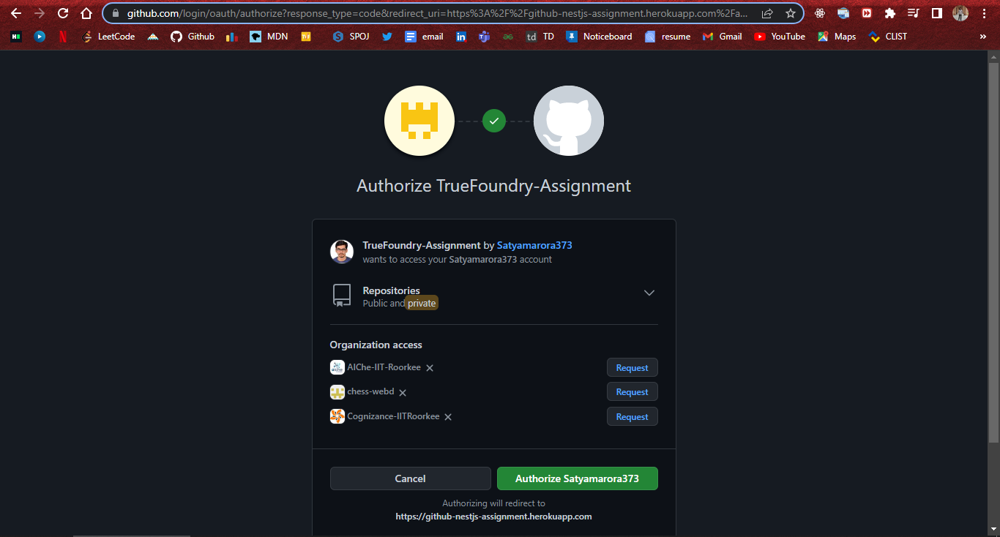
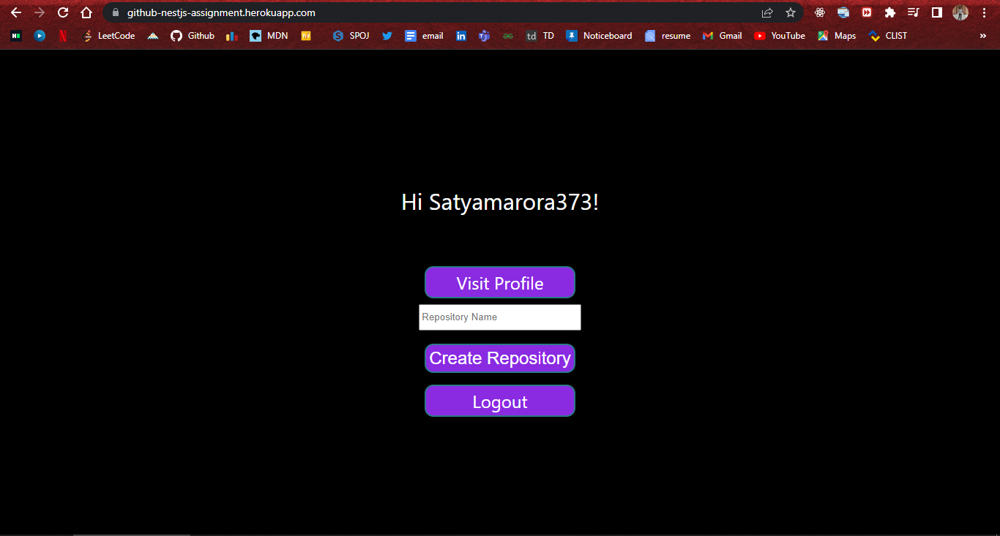

## Description

A Github OAuth App that creates new repository in your Github Account.

- Click on Login with Github Button

  

- Login to the app using your Github account & grant repository access.



- After logging in, specify name & click on Create Repository Button to create a new repository in your account.



- On successful creation of Repository, following response is obtained.


- If Repository Creation fails, response will contain the error message.


## Installation

```bash
#Clone Repository
$ git clone https://github.com/Satyamarora373/test.git

#Change Directory to project
$ cd test

#Install dependencies
$ npm install
```


## Running the app

```bash
# development
$ npm run start

# watch mode {Automatically restart server whenever a change in a src file is saved}
$ npm run start:dev
```


## Key Features of the app
- Using their Github account, the user logs into the app. The Passport library will manage the Github OAuth flow.
- Github returns an Access Token when the OAuth flow has been successfully completed, which the application can use to request that the user create a new repository in their Github account.
- Along with other user information like the username and profile URL, this token is kept in a SQLite database. Used DB sequelization as ORM
- It makes advantage of session-based authentication. Additionally, user sessions are kept in the backend SQLite database.
- After a successful login, the backend creates a cookie and sends it back to the user. On subsequent queries, this cookie may be used to recognise the user.
- Sessions are removed from the DB when they expire or the user logs out.
